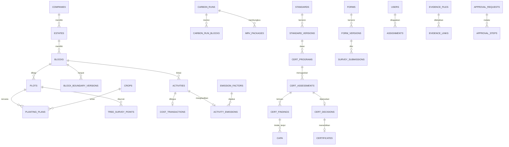

# AgroVision — Desain Skema Database

> Status: **draft untuk direview**
> Target: PostgreSQL 16 + PostGIS 3.4 di Cloud SQL (region `asia-southeast2` / Jakarta)
> Sumber kebenaran domain: `src/data/dummy.ts`, `src/data/certification.ts`, `src/data/mobile.ts`, dan enum inline di `src/app/(app)/**`

---

## 1. Ruang lingkup

Dokumen ini mendefinisikan skema database untuk mengubah prototype AgroVision (34 halaman, data statis) menjadi aplikasi yang berfungsi.

**Cakupan DDL lengkap** — domain yang sudah tersedia spesifikasinya di prototype:
`core`, `gis`, `agroforestry`, `costing`, `carbon`, `certification`, `survey`, `workflow & audit`

**Cakupan outline saja** — domain yang masih placeholder di prototype, jadi belum cukup informasi untuk difinalkan:
`traceability`, `nursery` (sebagian), `integrasi ERP`

Total ± 58 tabel. Lihat §12 untuk daftar pertanyaan yang masih terbuka.

---

## 2. Konvensi

| Aspek | Keputusan |
|---|---|
| Bahasa identifier | **Inggris**, `snake_case`. Label UI tetap Indonesia — lihat glosarium §11 |
| Schema | Satu schema `app`. PostGIS di `public` |
| Primary key | `uuid` + `gen_random_uuid()` (built-in PG13+) |
| Kode bisnis | Kolom terpisah `code` (mis. `AGF-A12`, `CERT-2026-0012`), unique per tenant |
| Waktu | **`timestamptz` selalu.** Simpan UTC, tampilkan WIB di aplikasi |
| Uang | `numeric(18,2)` — **jangan `float`**. Satuan IDR |
| Karbon | `numeric(14,4)` satuan tCO2e |
| Luas | `numeric(12,4)` satuan hektar |
| Geometry | `geometry(MultiPolygon, 4326)` / `geometry(Point, 4326)` |
| Enum | `CREATE TYPE` untuk nilai stabil; tabel lookup untuk yang bisa berubah |
| Delete | **Tidak ada hard delete** pada data operasional. `archived_at` atau status |

Setiap tabel operasional membawa kolom audit standar:

```sql
created_at   timestamptz NOT NULL DEFAULT now(),
created_by   uuid REFERENCES app.users(id),
updated_at   timestamptz NOT NULL DEFAULT now(),
updated_by   uuid REFERENCES app.users(id)
```

---

## 3. Sepuluh keputusan desain kunci

Bagian ini yang paling penting dibaca. Sisanya adalah konsekuensi dari sini.

### 3.1 Emission factor tidak pernah di-UPDATE, hanya ditambah versi

Ini **keputusan paling kritis** di seluruh sistem. Kredibilitas MRV bergantung sepenuhnya pada kemampuan menjawab: *"angka 42,6 tCO2e bulan Juni itu dihitung pakai faktor versi mana, dari standar apa, siapa yang menyetujui?"*

Prototype sudah menunjukkan kesadaran ini — ada status `"Versi lama (2024)"` dan `"Missing Factor"` di [dummy.ts](../src/data/dummy.ts). Skema harus menegakkannya:

- `emission_factors` bersifat **append-only**. Revisi = baris baru dengan `version` naik, bukan UPDATE.
- Setiap perhitungan menyimpan `emission_factor_id` **spesifik** yang dipakai, bukan hanya kode faktornya.
- Akibatnya setiap `carbon_run` bisa direproduksi persis, bahkan bertahun-tahun kemudian.

### 3.2 Carbon run bersifat immutable; koreksi = run baru

`carbon_runs` (mis. `CR-2026-06`) tidak boleh diedit setelah di-approve. Kalau ada koreksi, buat run baru yang menunjuk `supersedes_run_id`. Riwayat versi perhitungan justru **aset** untuk audit, bukan sampah.

### 3.3 Prinsip yang sama berlaku untuk form survei dan standar sertifikasi

Tiga hal ini punya masalah identik — **definisi berubah, tapi data lama harus tetap terbaca**:

| Definisi | Data yang merujuk |
|---|---|
| `emission_factors` | `activity_emissions` |
| `form_versions` | `survey_submissions` |
| `standard_versions` | `cert_assessments` |

Solusi seragam: definisi berversi + data menyimpan FK ke **versi**, bukan ke induknya. Kalau ini dilewatkan, submission tahun lalu jadi tidak bisa diinterpretasi begitu form-nya diubah.

### 3.4 Luas dihitung database, bukan diinput manual

Prototype menampilkan `luasTotal: "184,5 ha"` sebagai string. Di produksi, luas **wajib** turunan dari geometry — kalau tidak, angka peta dan angka laporan akan berbeda dan tidak ada yang tahu mana yang benar.

```sql
area_ha numeric(12,4) GENERATED ALWAYS AS (ST_Area(geom::geography) / 10000.0) STORED
```

Pakai `::geography`, **bukan** UTM. Indonesia melintasi banyak zona UTM (46N–54S), jadi memilih satu zona akan salah untuk estate di zona lain. `geography` menghitung di atas elipsoid dan benar di mana saja.

> ⚠️ **Uji ini sebelum menjalankan `0003`.** Generated column mensyaratkan fungsi `IMMUTABLE`, dan volatilitas fungsi PostGIS pernah berubah antar versi — jadi ini tidak bisa diasumsikan. Tes satu baris:
>
> ```sql
> CREATE TEMP TABLE _t (
>   geom geometry(MultiPolygon,4326),
>   area_ha numeric(12,4) GENERATED ALWAYS AS (ST_Area(geom::geography)/10000.0) STORED
> );
> ```
>
> Kalau gagal dengan `generation expression is not immutable`, pakai fallback berikut — ubah `area_ha` menjadi kolom biasa dan pasang trigger:
>
> ```sql
> CREATE OR REPLACE FUNCTION app.set_area_ha() RETURNS trigger
> LANGUAGE plpgsql AS $$
> BEGIN
>   NEW.area_ha := ST_Area(NEW.geom::geography) / 10000.0;
>   RETURN NEW;
> END $$;
>
> CREATE TRIGGER blocks_area_ha BEFORE INSERT OR UPDATE OF geom
>   ON app.blocks FOR EACH ROW EXECUTE FUNCTION app.set_area_ha();
> ```
>
> Trigger yang sama dipakai untuk `estates`, `plots`, dan `blocks`. Pilih **satu** mekanisme dan pakai konsisten di ketiga tabel — jangan dicampur.

### 3.5 Overlap dilaporkan untuk direview, bukan ditolak keras

Badge `"No Overlap"` di prototype harus benar-benar dihitung. Tapi **jangan** pakai `EXCLUDE` constraint:

- Operator `&&` hanya membandingkan bounding box → banyak false positive.
- Menolak import shapefile secara keras akan membuat surveyor mentok tanpa jalan keluar.

Yang benar secara produk: import tetap diterima, sistem mendeteksi overlap dan mencatatnya di `boundary_overlaps` sebagai temuan, lalu manusia yang memutuskan. Deteksi via trigger dengan toleransi luas:

```sql
-- overlap dianggap nyata bila > 100 m² (bukan artefak presisi digitasi)
ST_Area(ST_Intersection(a.geom, b.geom)::geography) > 100
```

### 3.6 Data lapangan bersifat append-only — itu yang membuat sync offline jauh lebih sederhana

Kekhawatiran terbesar orang soal offline adalah conflict resolution. Untuk aplikasi ini masalahnya jauh lebih kecil dari dugaan, karena **observasi lapangan pada dasarnya INSERT, bukan UPDATE**: tree inventory titik 12, foto geotag, jawaban checklist — semuanya fakta baru, bukan perubahan fakta lama.

Strateginya jadi terbelah rapi:

| Jenis data | Arah | Strategi konflik |
|---|---|---|
| Master (blok, standar, faktor) | server → device, **read-only** di device | Tidak ada konflik |
| Observasi (survei, inventory, foto) | device → server, **insert-only** | Tidak ada konflik; idempoten via `client_uuid` |
| Assignment status | dua arah | Server authoritative + `version` untuk optimistic lock |

Kuncinya: **device yang membuat UUID**, bukan server. Retry yang sama akan ditolak unique constraint, jadi aman diulang berapa kali pun. Prototype sudah punya `retry: 2` di [mobile.ts](../src/data/mobile.ts) — ini yang membuatnya benar.

### 3.7 Audit log append-only ditegakkan di level hak akses

MRV dan sertifikasi mensyaratkan bukti tidak bisa diubah diam-diam. Tidak cukup mengandalkan disiplin developer:

```sql
REVOKE UPDATE, DELETE ON app.audit_log FROM app_rw;
REVOKE UPDATE, DELETE ON app.evidence_files FROM app_rw;
```

### 3.8 Evidence adalah entitas kelas satu, bukan kolom URL

Prototype memperlakukan evidence sebagai teks (`evidence: "Foto + GPS"`). Padahal satu file evidence dipakai lintas modul: satu foto geotag bisa jadi bukti untuk tree inventory **dan** kriteria sertifikasi 3.2 sekaligus.

Jadi: satu tabel `evidence_files` + tabel penghubung polimorfik `evidence_links`. Wajib ada `sha256` untuk integritas, dan `taken_at` + `geom` + `gps_accuracy_m` dari EXIF.

### 3.9 Tree inventory disimpan sebagai sampling, bukan per pohon

Data prototype menunjukkan `{ titik: 10, species: "Kelapa", jumlah: 25 }` — artinya **agregat per titik sampel**, bukan satu baris per pohon. Ini benar untuk kelapa (28.450 pohon; mencatat individual tidak praktis).

Tapi durian bernilai tinggi per pohon dan klien mungkin ingin melacaknya individual. Skema mengakomodasi keduanya: `tree_survey_points` (sampling, dipakai sekarang) dan `trees` (individual, opsional per species). **Ini perlu dikonfirmasi ke klien** — lihat §12.

### 3.10 `company_id` disertakan sejak awal

Sekarang hanya satu tenant (PT Agro Lestari Nusantara), jadi ini terasa berlebihan. Tapi AgroVision dipitch sebagai produk untuk perusahaan perkebunan (jamak). Menambahkan `company_id` sekarang **hampir gratis**; menambahkannya setelah 58 tabel terisi data adalah proyek migrasi tersendiri.

---

## 4. Peta domain



---

## 5. Fondasi

```sql
CREATE EXTENSION IF NOT EXISTS postgis;
CREATE EXTENSION IF NOT EXISTS btree_gist;   -- constraint campuran skalar + geometry
CREATE EXTENSION IF NOT EXISTS pg_trgm;      -- pencarian teks
CREATE EXTENSION IF NOT EXISTS citext;       -- email case-insensitive
CREATE SCHEMA IF NOT EXISTS app;

-- Role aplikasi. Append-only ditegakkan dengan mencabut hak dari role ini (§3.7).
CREATE ROLE app_rw;   -- dipakai Cloud Run service
CREATE ROLE app_ro;   -- dipakai reporting / read replica
```

### 5.1 Tenant & organisasi

```sql
CREATE TABLE app.companies (
  id          uuid PRIMARY KEY DEFAULT gen_random_uuid(),
  code        text NOT NULL UNIQUE,
  name        text NOT NULL,              -- 'PT Agro Lestari Nusantara'
  timezone    text NOT NULL DEFAULT 'Asia/Jakarta',
  created_at  timestamptz NOT NULL DEFAULT now()
);

CREATE TABLE app.estates (
  id          uuid PRIMARY KEY DEFAULT gen_random_uuid(),
  company_id  uuid NOT NULL REFERENCES app.companies(id),
  code        text NOT NULL,
  name        text NOT NULL,              -- 'Estate Sejahtera'
  geom        geometry(MultiPolygon, 4326),
  area_ha     numeric(12,4) GENERATED ALWAYS AS (ST_Area(geom::geography)/10000.0) STORED,
  created_at  timestamptz NOT NULL DEFAULT now(),
  UNIQUE (company_id, code)
);
CREATE INDEX estates_geom_gix ON app.estates USING GIST (geom);

CREATE TABLE app.divisions (           -- 'Divisi Agroforestry 2'
  id          uuid PRIMARY KEY DEFAULT gen_random_uuid(),
  estate_id   uuid NOT NULL REFERENCES app.estates(id),
  code        text NOT NULL,
  name        text NOT NULL,
  UNIQUE (estate_id, code)
);
```

### 5.2 Pengguna, peran, dan lingkup akses

Peran diturunkan dari yang terlihat di prototype: Surveyor/Enumerator, Auditor, Mandor/PIC, Sustainability Manager, Approver, Admin.

```sql
CREATE TYPE app.user_role AS ENUM (
  'admin', 'manager', 'approver', 'sustainability_manager',
  'auditor', 'supervisor', 'surveyor', 'viewer'
);

CREATE TABLE app.users (
  id            uuid PRIMARY KEY DEFAULT gen_random_uuid(),
  company_id    uuid NOT NULL REFERENCES app.companies(id),
  -- 'sub' dari Identity Platform. Password TIDAK disimpan di sini.
  external_id   text NOT NULL UNIQUE,
  email         citext NOT NULL,
  full_name     text NOT NULL,
  role          app.user_role NOT NULL DEFAULT 'viewer',
  phone         text,
  is_active     boolean NOT NULL DEFAULT true,
  created_at    timestamptz NOT NULL DEFAULT now(),
  UNIQUE (company_id, email)
);

-- Pembatasan per estate. Tidak ada baris = akses seluruh company.
CREATE TABLE app.user_estate_access (
  user_id    uuid NOT NULL REFERENCES app.users(id) ON DELETE CASCADE,
  estate_id  uuid NOT NULL REFERENCES app.estates(id) ON DELETE CASCADE,
  PRIMARY KEY (user_id, estate_id)
);
```

---

## 6. GIS & Pemetaan

Ini modul yang paling banyak berubah dari prototype — `MapPanel` sekarang hanya kotak berkoordinat persen.

```sql
CREATE TYPE app.boundary_source AS ENUM (
  'gps_survey', 'drone_ortho', 'shapefile_import', 'manual_digitize', 'legacy_document'
);
CREATE TYPE app.verification_status AS ENUM (
  'draft', 'submitted', 'verified', 'rejected'
);

CREATE TABLE app.blocks (
  id                  uuid PRIMARY KEY DEFAULT gen_random_uuid(),
  company_id          uuid NOT NULL REFERENCES app.companies(id),
  estate_id           uuid NOT NULL REFERENCES app.estates(id),
  division_id         uuid REFERENCES app.divisions(id),
  code                text NOT NULL,                    -- 'AGF-A12'
  name                text,
  geom                geometry(MultiPolygon, 4326) NOT NULL,
  area_ha             numeric(12,4) GENERATED ALWAYS AS (ST_Area(geom::geography)/10000.0) STORED,
  planted_area_ha     numeric(12,4),                    -- turunan dari plots
  conservation_area_ha numeric(12,4),
  planting_year        integer,                         -- 'tahunTanam' di eligiblePlots
  boundary_source     app.boundary_source NOT NULL,
  verification_status app.verification_status NOT NULL DEFAULT 'draft',
  verified_at         timestamptz,
  verified_by         uuid REFERENCES app.users(id),
  current_version     integer NOT NULL DEFAULT 1,
  archived_at         timestamptz,
  created_at          timestamptz NOT NULL DEFAULT now(),
  created_by          uuid REFERENCES app.users(id),
  updated_at          timestamptz NOT NULL DEFAULT now(),
  updated_by          uuid REFERENCES app.users(id),
  UNIQUE (company_id, code),
  CONSTRAINT blocks_geom_valid CHECK (ST_IsValid(geom))
);
CREATE INDEX blocks_geom_gix ON app.blocks USING GIST (geom);
CREATE INDEX blocks_estate_idx ON app.blocks (estate_id) WHERE archived_at IS NULL;
```

### 6.1 Riwayat batas — kenapa wajib

Approval queue prototype punya item `"Blok AGF-D11 - Revisi Batas"`. Artinya batas blok **berubah** dan perubahannya melalui persetujuan. Kalau geometry lama ditimpa, perhitungan karbon periode lalu jadi tidak bisa dipertanggungjawabkan — luasnya sudah berbeda.

```sql
CREATE TABLE app.block_boundary_versions (
  id              uuid PRIMARY KEY DEFAULT gen_random_uuid(),
  block_id        uuid NOT NULL REFERENCES app.blocks(id),
  version         integer NOT NULL,
  geom            geometry(MultiPolygon, 4326) NOT NULL,
  area_ha         numeric(12,4) NOT NULL,
  boundary_source app.boundary_source NOT NULL,
  change_reason   text,
  effective_from  timestamptz NOT NULL,
  effective_to    timestamptz,                -- NULL = versi berlaku saat ini
  approval_id     uuid,                       -- FK ke approval_requests
  created_at      timestamptz NOT NULL DEFAULT now(),
  created_by      uuid REFERENCES app.users(id),
  UNIQUE (block_id, version)
);
```

### 6.2 Plot & crop layer

Agroforestry berarti **beberapa lapis tanaman di lahan yang sama** — kelapa dan durian bertumpang. Jadi relasi plot→crop adalah many-to-many, bukan satu kolom species.

```sql
CREATE TYPE app.land_use AS ENUM ('productive', 'conservation', 'buffer', 'infrastructure', 'nursery');

CREATE TABLE app.plots (
  id          uuid PRIMARY KEY DEFAULT gen_random_uuid(),
  block_id    uuid NOT NULL REFERENCES app.blocks(id),
  code        text NOT NULL,
  geom        geometry(MultiPolygon, 4326) NOT NULL,
  area_ha     numeric(12,4) GENERATED ALWAYS AS (ST_Area(geom::geography)/10000.0) STORED,
  land_use    app.land_use NOT NULL DEFAULT 'productive',
  created_at  timestamptz NOT NULL DEFAULT now(),
  UNIQUE (block_id, code),
  CONSTRAINT plots_geom_valid CHECK (ST_IsValid(geom))
);
CREATE INDEX plots_geom_gix ON app.plots USING GIST (geom);

CREATE TABLE app.crops (
  id             uuid PRIMARY KEY DEFAULT gen_random_uuid(),
  code           text NOT NULL UNIQUE,        -- 'KELAPA', 'DURIAN'
  name           text NOT NULL,
  scientific_name text,
  variety        text,                        -- 'Kelapa Genjah'
  is_tree        boolean NOT NULL DEFAULT true,
  track_individual_trees boolean NOT NULL DEFAULT false   -- lihat §3.9
);

CREATE TABLE app.plot_crop_layers (
  plot_id      uuid NOT NULL REFERENCES app.plots(id) ON DELETE CASCADE,
  crop_id      uuid NOT NULL REFERENCES app.crops(id),
  layer_order  smallint NOT NULL DEFAULT 1,   -- 1 = tajuk utama
  spacing_m    numeric(6,2),
  trees_per_ha numeric(8,2),
  PRIMARY KEY (plot_id, crop_id)
);
```

### 6.3 Import batas & deteksi overlap

```sql
CREATE TYPE app.import_status AS ENUM ('uploaded','validating','needs_review','applied','failed');

CREATE TABLE app.boundary_imports (
  id             uuid PRIMARY KEY DEFAULT gen_random_uuid(),
  company_id     uuid NOT NULL REFERENCES app.companies(id),
  file_name      text NOT NULL,
  storage_path   text NOT NULL,               -- gs://.../imports/...
  format         text NOT NULL,               -- shapefile | geojson | kml
  source_srid    integer,
  feature_count  integer,
  status         app.import_status NOT NULL DEFAULT 'uploaded',
  error_detail   jsonb,
  uploaded_by    uuid REFERENCES app.users(id),
  created_at     timestamptz NOT NULL DEFAULT now()
);

CREATE TABLE app.boundary_overlaps (
  id              uuid PRIMARY KEY DEFAULT gen_random_uuid(),
  block_a_id      uuid NOT NULL REFERENCES app.blocks(id),
  block_b_id      uuid NOT NULL REFERENCES app.blocks(id),
  overlap_geom    geometry(MultiPolygon, 4326),
  overlap_area_ha numeric(12,4) NOT NULL,
  detected_at     timestamptz NOT NULL DEFAULT now(),
  resolved_at     timestamptz,
  resolved_by     uuid REFERENCES app.users(id),
  resolution_note text,
  CONSTRAINT overlap_distinct CHECK (block_a_id <> block_b_id)
);
```

### 6.4 Foto udara drone

Ingat batasan dari analisis deployment: orthophoto untuk 25.734 ha berukuran puluhan GB. File-nya di Cloud Storage sebagai **COG**, database hanya menyimpan metadata + footprint.

```sql
CREATE TABLE app.drone_orthophotos (
  id            uuid PRIMARY KEY DEFAULT gen_random_uuid(),
  estate_id     uuid NOT NULL REFERENCES app.estates(id),
  code          text NOT NULL,
  captured_at   date NOT NULL,
  footprint     geometry(MultiPolygon, 4326) NOT NULL,
  cog_path      text NOT NULL,                -- gs://.../ortho/xxx.tif
  gsd_cm        numeric(6,2),                 -- ground sample distance
  size_bytes    bigint,
  tile_url      text,                         -- endpoint tile-server
  created_at    timestamptz NOT NULL DEFAULT now()
);
CREATE INDEX ortho_footprint_gix ON app.drone_orthophotos USING GIST (footprint);
```

---

## 7. Agroforestry

```sql
CREATE TYPE app.tree_condition AS ENUM ('baik','sedang','buruk','mati');       -- dari mobile-preview
CREATE TYPE app.growth_phase   AS ENUM ('bibit','vegetatif','produktif');      -- dari mobile-preview
CREATE TYPE app.plan_status    AS ENUM ('on_track','tertunda','selesai','dibatalkan');

CREATE TABLE app.planting_plans (
  id             uuid PRIMARY KEY DEFAULT gen_random_uuid(),
  block_id       uuid NOT NULL REFERENCES app.blocks(id),
  plot_id        uuid REFERENCES app.plots(id),
  crop_id        uuid NOT NULL REFERENCES app.crops(id),
  season_year    integer NOT NULL,
  target_trees   integer NOT NULL,
  planned_start  date,
  planned_end    date,
  pic_user_id    uuid REFERENCES app.users(id),
  status         app.plan_status NOT NULL DEFAULT 'on_track',
  created_at     timestamptz NOT NULL DEFAULT now(),
  UNIQUE (block_id, crop_id, season_year)
);

-- Realisasi tanam: append-only, satu baris per kejadian tanam/sulam
CREATE TABLE app.planting_records (
  id              uuid PRIMARY KEY DEFAULT gen_random_uuid(),
  planting_plan_id uuid NOT NULL REFERENCES app.planting_plans(id),
  planted_on      date NOT NULL,
  tree_count      integer NOT NULL CHECK (tree_count > 0),
  seed_batch_id   uuid REFERENCES app.seed_batches(id),   -- mata rantai ke traceability
  is_replanting   boolean NOT NULL DEFAULT false,         -- 'penyulaman'
  recorded_by     uuid REFERENCES app.users(id),
  created_at      timestamptz NOT NULL DEFAULT now()
);
```

### 7.1 Tree inventory

```sql
CREATE TABLE app.tree_survey_points (
  id              uuid PRIMARY KEY DEFAULT gen_random_uuid(),
  client_uuid     uuid NOT NULL UNIQUE,        -- dibuat device; idempotensi sync
  code            text,                        -- 'TI-2606-001'
  block_id        uuid NOT NULL REFERENCES app.blocks(id),
  plot_id         uuid REFERENCES app.plots(id),
  crop_id         uuid NOT NULL REFERENCES app.crops(id),
  point_number    integer,                     -- 'titik: 12'
  geom            geometry(Point, 4326),
  gps_accuracy_m  numeric(6,2),
  tree_count      integer NOT NULL,
  condition       app.tree_condition NOT NULL,
  growth_phase    app.growth_phase NOT NULL,
  surveyed_at     timestamptz NOT NULL,
  surveyor_id     uuid REFERENCES app.users(id),
  assignment_id   uuid REFERENCES app.assignments(id),
  synced_at       timestamptz NOT NULL DEFAULT now(),
  created_at      timestamptz NOT NULL DEFAULT now()
);
CREATE INDEX tree_survey_geom_gix ON app.tree_survey_points USING GIST (geom);
CREATE INDEX tree_survey_block_idx ON app.tree_survey_points (block_id, surveyed_at DESC);

-- Opsional per species (track_individual_trees = true). Lihat §3.9 dan §12.
CREATE TABLE app.trees (
  id            uuid PRIMARY KEY DEFAULT gen_random_uuid(),
  plot_id       uuid NOT NULL REFERENCES app.plots(id),
  crop_id       uuid NOT NULL REFERENCES app.crops(id),
  tag_code      text,                          -- nomor tag fisik / QR
  geom          geometry(Point, 4326),
  planted_on    date,
  seed_batch_id uuid REFERENCES app.seed_batches(id),
  current_condition app.growth_phase,
  removed_at    date,
  UNIQUE (plot_id, tag_code)
);
```

Survival rate **tidak disimpan sebagai kolom** — dihitung dari `planting_records` vs kondisi terakhir di `tree_survey_points`. Menyimpannya sebagai kolom berarti mengundang inkonsistensi. Kalau perlu cepat, pakai materialized view yang di-refresh terjadwal.

### 7.2 Aktivitas budidaya

Satu tabel `activities` adalah **titik temu tiga modul**: ia dibiayai (costing), menghasilkan emisi (carbon), dan menjadi bukti kepatuhan (sertifikasi). Ini simpul terpenting di skema setelah `blocks`.

```sql
CREATE TABLE app.activity_types (
  id             uuid PRIMARY KEY DEFAULT gen_random_uuid(),
  internal_code  text NOT NULL UNIQUE,        -- 'FERT-001'
  name           text NOT NULL,               -- 'Pemupukan NPK'
  cost_center_id uuid REFERENCES app.cost_centers(id),
  default_unit   text NOT NULL,               -- kg | liter | km | ha | HOK
  is_active      boolean NOT NULL DEFAULT true
);

CREATE TABLE app.activities (
  id               uuid PRIMARY KEY DEFAULT gen_random_uuid(),
  company_id       uuid NOT NULL REFERENCES app.companies(id),
  activity_type_id uuid NOT NULL REFERENCES app.activity_types(id),
  block_id         uuid NOT NULL REFERENCES app.blocks(id),
  plot_id          uuid REFERENCES app.plots(id),
  performed_on     date NOT NULL,
  quantity         numeric(14,3) NOT NULL,
  unit             text NOT NULL,
  pic_user_id      uuid REFERENCES app.users(id),
  status           text NOT NULL DEFAULT 'selesai',   -- selesai|berjalan|menunggu_qc
  note             text,
  created_at       timestamptz NOT NULL DEFAULT now(),
  created_by       uuid REFERENCES app.users(id)
);
CREATE INDEX activities_block_date_idx ON app.activities (block_id, performed_on DESC);
CREATE INDEX activities_type_idx ON app.activities (activity_type_id, performed_on DESC);
```

---

## 8. Costing

```sql
CREATE TABLE app.cost_centers (
  id        uuid PRIMARY KEY DEFAULT gen_random_uuid(),
  code      text NOT NULL UNIQUE,
  name      text NOT NULL     -- Maintenance | Mekanisasi | Plantation | Logistik | Processing
);

CREATE TABLE app.vendors (
  id           uuid PRIMARY KEY DEFAULT gen_random_uuid(),
  company_id   uuid NOT NULL REFERENCES app.companies(id),
  code         text NOT NULL,
  name         text NOT NULL,     -- 'PT Agro Makmur Sejahtera'
  npwp         text,
  is_active    boolean NOT NULL DEFAULT true,
  UNIQUE (company_id, code)
);

CREATE TYPE app.cost_status AS ENUM ('draft','menunggu','disetujui','ditolak');

CREATE TABLE app.cost_transactions (
  id              uuid PRIMARY KEY DEFAULT gen_random_uuid(),
  company_id      uuid NOT NULL REFERENCES app.companies(id),
  activity_id     uuid REFERENCES app.activities(id),      -- NULL = biaya tak terpetakan
  cost_center_id  uuid NOT NULL REFERENCES app.cost_centers(id),
  block_id        uuid REFERENCES app.blocks(id),
  vendor_id       uuid REFERENCES app.vendors(id),
  transaction_date date NOT NULL,
  quantity        numeric(14,3),
  unit            text,
  amount_idr      numeric(18,2) NOT NULL,
  status          app.cost_status NOT NULL DEFAULT 'draft',
  erp_document_no text,                                    -- kunci rekonsiliasi ERP
  erp_synced_at   timestamptz,
  created_at      timestamptz NOT NULL DEFAULT now(),
  UNIQUE (company_id, erp_document_no)
);
CREATE INDEX cost_tx_date_idx ON app.cost_transactions (transaction_date DESC);
CREATE INDEX cost_tx_unmapped_idx ON app.cost_transactions (company_id)
  WHERE activity_id IS NULL;   -- KPI 'Termapping ke Costing'

CREATE TABLE app.budgets (
  id           uuid PRIMARY KEY DEFAULT gen_random_uuid(),
  company_id   uuid NOT NULL REFERENCES app.companies(id),
  estate_id    uuid REFERENCES app.estates(id),
  cost_center_id uuid REFERENCES app.cost_centers(id),
  period_month date NOT NULL,                 -- selalu tanggal 1
  amount_idr   numeric(18,2) NOT NULL,
  UNIQUE (company_id, estate_id, cost_center_id, period_month)
);

CREATE TABLE app.erp_sync_logs (
  id            uuid PRIMARY KEY DEFAULT gen_random_uuid(),
  source        text NOT NULL,                -- 'ERP Sync' | 'Import Excel'
  started_at    timestamptz NOT NULL,
  finished_at   timestamptz,
  rows_total    integer,
  rows_ok       integer,
  rows_failed   integer,
  status        text NOT NULL,                -- sukses|sebagian|gagal
  detail        jsonb
);
```

---

## 9. Carbon

Modul yang paling menuntut ketelitian. Semua prinsip §3.1–3.2 diterapkan di sini.

```sql
CREATE TYPE app.carbon_status AS ENUM ('net_sink','neutral','net_emitter','data_incomplete');
CREATE TYPE app.ef_scope AS ENUM ('scope1','scope2','scope3');

CREATE TABLE app.emission_factors (
  id              uuid PRIMARY KEY DEFAULT gen_random_uuid(),
  code            text NOT NULL,                 -- 'EF-FERT-NPK-24'
  version         integer NOT NULL,
  activity_type_id uuid REFERENCES app.activity_types(id),
  name            text NOT NULL,
  value           numeric(14,6) NOT NULL,        -- 1.33
  unit_numerator  text NOT NULL DEFAULT 'kgCO2e',
  unit_denominator text NOT NULL,                -- kg | liter | km
  scope           app.ef_scope NOT NULL DEFAULT 'scope1',
  -- provenance: wajib untuk kredibilitas MRV
  source_standard text NOT NULL,                 -- 'IPCC 2019 Refinement' dsb
  source_citation text,
  uncertainty_pct numeric(6,2),
  valid_from      date NOT NULL,
  valid_to        date,                          -- NULL = masih berlaku
  approved_by     uuid REFERENCES app.users(id),
  approved_at     timestamptz,
  created_at      timestamptz NOT NULL DEFAULT now(),
  UNIQUE (code, version)
);
-- Hanya satu versi aktif per kode pada satu waktu
CREATE UNIQUE INDEX ef_active_uniq ON app.emission_factors (code) WHERE valid_to IS NULL;

-- APPEND-ONLY: revisi = baris baru dengan version+1, bukan UPDATE.
-- Dicabut dari role aplikasi, bukan dari PUBLIC (PUBLIC memang tidak pernah punya hak ini).
REVOKE UPDATE, DELETE ON app.emission_factors FROM app_rw;
```

```sql
CREATE TABLE app.activity_emissions (
  id                 uuid PRIMARY KEY DEFAULT gen_random_uuid(),
  activity_id        uuid NOT NULL REFERENCES app.activities(id),
  -- FK ke VERSI faktor, bukan ke kode. Inilah yang membuat run reproducible.
  emission_factor_id uuid REFERENCES app.emission_factors(id),
  quantity           numeric(14,3) NOT NULL,     -- disnapshot saat hitung
  factor_value       numeric(14,6),              -- disnapshot; tahan perubahan
  emission_tco2e     numeric(14,4),
  status             text NOT NULL,              -- lengkap|missing_factor|perlu_review
  calculated_at      timestamptz NOT NULL DEFAULT now(),
  UNIQUE (activity_id)
);
CREATE INDEX act_emis_missing_idx ON app.activity_emissions (status)
  WHERE status <> 'lengkap';   -- KPI 'Missing Factor: 61'
```

```sql
CREATE TABLE app.sequestration_models (
  id            uuid PRIMARY KEY DEFAULT gen_random_uuid(),
  crop_id       uuid REFERENCES app.crops(id),
  land_use      app.land_use,
  version       integer NOT NULL,
  method         text NOT NULL,                 -- allometrik | tier-1 default
  formula_ref    text,
  tco2e_per_tree_year numeric(14,6),
  tco2e_per_ha_year   numeric(14,6),
  source_standard text NOT NULL,
  valid_from    date NOT NULL,
  valid_to      date,
  UNIQUE (crop_id, land_use, version)
);

CREATE TYPE app.run_status AS ENUM ('draft','calculated','menunggu_approval','approved','superseded');

CREATE TABLE app.carbon_runs (
  id                 uuid PRIMARY KEY DEFAULT gen_random_uuid(),
  company_id         uuid NOT NULL REFERENCES app.companies(id),
  code               text NOT NULL,              -- 'CR-2026-06'
  period_start       date NOT NULL,
  period_end         date NOT NULL,
  boundary_note      text,                       -- 'Estate Sejahtera, Estate Lestari'
  gross_emission_tco2e numeric(14,4),
  sequestration_tco2e  numeric(14,4),
  net_balance_tco2e    numeric(14,4),
  carbon_intensity     numeric(14,6),            -- kgCO2e/kg produk
  data_completeness_pct numeric(5,2),
  status             app.run_status NOT NULL DEFAULT 'draft',
  supersedes_run_id  uuid REFERENCES app.carbon_runs(id),   -- koreksi = run baru
  executed_at        timestamptz,
  executed_by        uuid REFERENCES app.users(id),
  approved_at        timestamptz,
  approved_by        uuid REFERENCES app.users(id),
  UNIQUE (company_id, code)
);

CREATE TABLE app.carbon_run_blocks (
  run_id            uuid NOT NULL REFERENCES app.carbon_runs(id) ON DELETE CASCADE,
  block_id          uuid NOT NULL REFERENCES app.blocks(id),
  -- snapshot: luas bisa berubah setelah revisi batas
  area_ha_snapshot  numeric(12,4) NOT NULL,
  boundary_version  integer NOT NULL,
  emission_tco2e    numeric(14,4),
  sequestration_tco2e numeric(14,4),
  net_tco2e         numeric(14,4),
  status            app.carbon_status NOT NULL,
  PRIMARY KEY (run_id, block_id)
);

CREATE TABLE app.mrv_packages (
  id             uuid PRIMARY KEY DEFAULT gen_random_uuid(),
  run_id         uuid NOT NULL REFERENCES app.carbon_runs(id),
  status         text NOT NULL,
  reviewer_id    uuid REFERENCES app.users(id),
  export_path    text,                      -- gs://.../mrv/CR-2026-06.zip
  export_sha256  text,
  generated_at   timestamptz
);

CREATE TABLE app.mrv_package_sections (
  package_id   uuid NOT NULL REFERENCES app.mrv_packages(id) ON DELETE CASCADE,
  section_name text NOT NULL,               -- Polygon | Activity Data | ...
  item_count   integer NOT NULL,
  status       text NOT NULL,               -- lengkap|sebagian|belum
  PRIMARY KEY (package_id, section_name)
);
```

---

## 10. Sertifikasi, Survei, Workflow

### 10.1 Sertifikasi

```sql
CREATE TABLE app.standards (
  id       uuid PRIMARY KEY DEFAULT gen_random_uuid(),
  code     text NOT NULL UNIQUE,          -- 'STD-001'
  name     text NOT NULL,                 -- 'Rainforest Alliance 2020'
  issuer   text NOT NULL,
  validity_months integer                 -- masa berlaku sertifikat
);

CREATE TABLE app.standard_versions (
  id           uuid PRIMARY KEY DEFAULT gen_random_uuid(),
  standard_id  uuid NOT NULL REFERENCES app.standards(id),
  version      text NOT NULL,             -- 'v1.3'
  status       text NOT NULL,             -- draft|active|retired
  published_at date,
  UNIQUE (standard_id, version)
);

CREATE TABLE app.standard_criteria (
  id                  uuid PRIMARY KEY DEFAULT gen_random_uuid(),
  standard_version_id uuid NOT NULL REFERENCES app.standard_versions(id),
  parent_id           uuid REFERENCES app.standard_criteria(id),   -- Prinsip > Kriteria
  code                text NOT NULL,      -- '1.1', '3.2'
  title               text NOT NULL,
  is_critical         boolean NOT NULL DEFAULT false,  -- gagal = tidak lulus otomatis
  max_score           integer NOT NULL DEFAULT 10,
  evidence_required   text[],
  sort_order          integer,
  UNIQUE (standard_version_id, code)
);

CREATE TABLE app.standard_crops (
  standard_id uuid NOT NULL REFERENCES app.standards(id),
  crop_id     uuid NOT NULL REFERENCES app.crops(id),
  PRIMARY KEY (standard_id, crop_id)
);

CREATE TABLE app.cert_programs (
  id                  uuid PRIMARY KEY DEFAULT gen_random_uuid(),
  company_id          uuid NOT NULL REFERENCES app.companies(id),
  code                text NOT NULL,      -- 'PRG-2026-01'
  name                text NOT NULL,
  standard_version_id uuid NOT NULL REFERENCES app.standard_versions(id),
  period_start        date NOT NULL,
  period_end          date NOT NULL,
  status              text NOT NULL,      -- berjalan|selesai|dibatalkan
  UNIQUE (company_id, code)
);

CREATE TABLE app.cert_program_blocks (
  program_id     uuid NOT NULL REFERENCES app.cert_programs(id) ON DELETE CASCADE,
  block_id       uuid NOT NULL REFERENCES app.blocks(id),
  readiness_pct  numeric(5,2),
  eligibility    text,                    -- eligible|missing_data
  missing_items  text[],
  PRIMARY KEY (program_id, block_id)
);

CREATE TYPE app.assessment_status AS ENUM
  ('assigned','in_progress','submitted','reviewed','revision_required');

CREATE TABLE app.cert_assessments (
  id            uuid PRIMARY KEY DEFAULT gen_random_uuid(),
  code          text NOT NULL UNIQUE,     -- 'ASG-CRT-001'
  program_id    uuid NOT NULL REFERENCES app.cert_programs(id),
  block_id      uuid NOT NULL REFERENCES app.blocks(id),
  auditor_id    uuid REFERENCES app.users(id),
  due_date      date,
  status        app.assessment_status NOT NULL DEFAULT 'assigned',
  score_pct     numeric(5,2),
  has_critical_failure boolean NOT NULL DEFAULT false,
  submitted_at  timestamptz,
  reviewed_by   uuid REFERENCES app.users(id),
  reviewed_at   timestamptz
);

CREATE TABLE app.cert_assessment_items (
  id            uuid PRIMARY KEY DEFAULT gen_random_uuid(),
  assessment_id uuid NOT NULL REFERENCES app.cert_assessments(id) ON DELETE CASCADE,
  criterion_id  uuid NOT NULL REFERENCES app.standard_criteria(id),
  status        text NOT NULL,            -- lengkap|sebagian|belum
  score         integer,
  auto_filled   boolean NOT NULL DEFAULT false,  -- diisi sistem dari data lain
  note          text,
  UNIQUE (assessment_id, criterion_id)
);

CREATE TYPE app.nc_severity AS ENUM ('minor','major','critical');
CREATE TYPE app.capa_status AS ENUM ('open','in_progress','submitted','closed','overdue');

CREATE TABLE app.cert_findings (
  id            uuid PRIMARY KEY DEFAULT gen_random_uuid(),
  assessment_id uuid NOT NULL REFERENCES app.cert_assessments(id),
  criterion_id  uuid REFERENCES app.standard_criteria(id),
  description   text NOT NULL,
  severity      app.nc_severity NOT NULL,
  created_at    timestamptz NOT NULL DEFAULT now()
);

CREATE TABLE app.capa (
  id           uuid PRIMARY KEY DEFAULT gen_random_uuid(),
  code         text NOT NULL UNIQUE,      -- 'CAPA-001'
  finding_id   uuid NOT NULL REFERENCES app.cert_findings(id),
  block_id     uuid NOT NULL REFERENCES app.blocks(id),
  pic_user_id  uuid REFERENCES app.users(id),
  action_plan  text,
  due_date     date NOT NULL,
  status       app.capa_status NOT NULL DEFAULT 'open',
  closed_at    timestamptz,
  closed_by    uuid REFERENCES app.users(id)
);

CREATE TYPE app.cert_decision AS ENUM
  ('certified','conditionally_certified','not_certified','pending_capa','suspended');

CREATE TABLE app.cert_decisions (
  id            uuid PRIMARY KEY DEFAULT gen_random_uuid(),
  code          text NOT NULL UNIQUE,     -- 'DEC-001'
  assessment_id uuid NOT NULL REFERENCES app.cert_assessments(id),
  decision      app.cert_decision NOT NULL,
  rationale     text,
  approver_id   uuid REFERENCES app.users(id),
  decided_at    timestamptz
);

CREATE TABLE app.certificates (
  id            uuid PRIMARY KEY DEFAULT gen_random_uuid(),
  code          text NOT NULL UNIQUE,     -- 'CERT-2026-0012'
  decision_id   uuid REFERENCES app.cert_decisions(id),
  standard_version_id uuid NOT NULL REFERENCES app.standard_versions(id),
  block_id      uuid NOT NULL REFERENCES app.blocks(id),
  valid_from    date NOT NULL,
  valid_until   date NOT NULL,
  revoked_at    timestamptz,
  document_path text,
  CONSTRAINT cert_period CHECK (valid_until > valid_from)
);
CREATE INDEX cert_expiry_idx ON app.certificates (valid_until)
  WHERE revoked_at IS NULL;   -- 'Expiring Soon' & renewal monitoring
```

Status `Active` / `Expiring Soon` / `Expired` **tidak disimpan** — dihitung dari `valid_until` vs `current_date`. Menyimpannya berarti butuh cron untuk memperbaruinya dan pasti akan pernah salah.

### 10.2 Survei & form builder

14 tipe field diambil dari `fieldTypes` di [template-builder/page.tsx](<../src/app/(app)/sertifikasi/template-builder/page.tsx>).

```sql
CREATE TYPE app.field_type AS ENUM (
  'teks','angka','tanggal','pilihan_tunggal','pilihan_ganda','yes_no','skala',
  'tabel','foto','dokumen','tanda_tangan','gps','polygon','qr_scan'
);

CREATE TABLE app.forms (
  id         uuid PRIMARY KEY DEFAULT gen_random_uuid(),
  company_id uuid NOT NULL REFERENCES app.companies(id),
  code       text NOT NULL,
  name       text NOT NULL,
  module     text NOT NULL,     -- agroforestry|sertifikasi|survei|nursery|panen
  UNIQUE (company_id, code)
);

-- Submission menunjuk VERSI. Tanpa ini, data lama jadi tak terbaca saat form diubah.
CREATE TABLE app.form_versions (
  id           uuid PRIMARY KEY DEFAULT gen_random_uuid(),
  form_id      uuid NOT NULL REFERENCES app.forms(id),
  version      integer NOT NULL,
  status       text NOT NULL DEFAULT 'draft',   -- draft|published|retired
  published_at timestamptz,
  UNIQUE (form_id, version)
);

CREATE TABLE app.form_fields (
  id              uuid PRIMARY KEY DEFAULT gen_random_uuid(),
  form_version_id uuid NOT NULL REFERENCES app.form_versions(id) ON DELETE CASCADE,
  section_name    text,
  code            text NOT NULL,
  label           text NOT NULL,
  field_type      app.field_type NOT NULL,
  is_required     boolean NOT NULL DEFAULT false,
  options         jsonb,          -- pilihan, min/max, skala
  validation      jsonb,
  sort_order      integer NOT NULL,
  UNIQUE (form_version_id, code)
);

CREATE TABLE app.survey_submissions (
  id              uuid PRIMARY KEY DEFAULT gen_random_uuid(),
  client_uuid     uuid NOT NULL UNIQUE,        -- idempotensi sync
  form_version_id uuid NOT NULL REFERENCES app.form_versions(id),
  assignment_id   uuid REFERENCES app.assignments(id),
  block_id        uuid REFERENCES app.blocks(id),
  geom            geometry(Point, 4326),
  submitted_by    uuid REFERENCES app.users(id),
  submitted_at    timestamptz NOT NULL,        -- waktu di device
  synced_at       timestamptz NOT NULL DEFAULT now(),
  device_id       text
);

-- Satu baris per jawaban, kolom bertipe. Bukan JSONB blob — supaya bisa diquery.
CREATE TABLE app.submission_values (
  submission_id uuid NOT NULL REFERENCES app.survey_submissions(id) ON DELETE CASCADE,
  field_id      uuid NOT NULL REFERENCES app.form_fields(id),
  value_text    text,
  value_num     numeric(18,4),
  value_bool    boolean,
  value_date    date,
  value_geom    geometry(Geometry, 4326),
  value_json    jsonb,                          -- untuk tipe 'tabel'
  PRIMARY KEY (submission_id, field_id)
);
```

### 10.3 Penugasan lapangan & sync

```sql
CREATE TYPE app.assignment_status AS ENUM
  ('new','downloaded','in_progress','draft','submitted','synced','rejected');
CREATE TYPE app.priority AS ENUM ('rendah','sedang','tinggi');

CREATE TABLE app.assignments (
  id            uuid PRIMARY KEY DEFAULT gen_random_uuid(),
  code          text NOT NULL UNIQUE,       -- 'ASG-001'
  module        text NOT NULL,
  title         text NOT NULL,
  block_id      uuid REFERENCES app.blocks(id),
  estate_id     uuid REFERENCES app.estates(id),
  form_version_id uuid REFERENCES app.form_versions(id),
  assignee_id   uuid NOT NULL REFERENCES app.users(id),
  due_at        timestamptz,
  priority      app.priority NOT NULL DEFAULT 'sedang',
  status        app.assignment_status NOT NULL DEFAULT 'new',
  target_note   text,                       -- '30 titik sampel'
  version       integer NOT NULL DEFAULT 1, -- optimistic lock utk sync dua arah
  created_at    timestamptz NOT NULL DEFAULT now()
);
CREATE INDEX assignments_assignee_idx ON app.assignments (assignee_id, status);

CREATE TABLE app.sync_sessions (
  id            uuid PRIMARY KEY DEFAULT gen_random_uuid(),
  user_id       uuid NOT NULL REFERENCES app.users(id),
  device_id     text NOT NULL,
  started_at    timestamptz NOT NULL DEFAULT now(),
  finished_at   timestamptz,
  items_total   integer,
  items_ok      integer,
  items_failed  integer,
  detail        jsonb
);
```

### 10.4 Evidence

```sql
CREATE TYPE app.evidence_type AS ENUM
  ('foto','dokumen','polygon','drone','traceability','tanda_tangan','audio');

CREATE TABLE app.evidence_files (
  id             uuid PRIMARY KEY DEFAULT gen_random_uuid(),
  client_uuid    uuid UNIQUE,
  company_id     uuid NOT NULL REFERENCES app.companies(id),
  evidence_type  app.evidence_type NOT NULL,
  file_name      text NOT NULL,
  storage_path   text NOT NULL,              -- gs://...
  mime_type      text,
  size_bytes     bigint,
  sha256         text NOT NULL,              -- integritas; wajib untuk audit
  geom           geometry(Point, 4326),      -- dari EXIF
  gps_accuracy_m numeric(6,2),
  taken_at       timestamptz,
  uploaded_by    uuid REFERENCES app.users(id),
  uploaded_at    timestamptz NOT NULL DEFAULT now(),
  verified_at    timestamptz,
  verified_by    uuid REFERENCES app.users(id)
);
CREATE INDEX evidence_geom_gix ON app.evidence_files USING GIST (geom);

-- Satu evidence bisa melekat ke banyak objek lintas modul.
CREATE TABLE app.evidence_links (
  evidence_id  uuid NOT NULL REFERENCES app.evidence_files(id) ON DELETE CASCADE,
  entity_type  text NOT NULL,   -- tree_survey_point|cert_assessment_item|activity|capa|...
  entity_id    uuid NOT NULL,
  link_note    text,
  auto_linked  boolean NOT NULL DEFAULT false,   -- 'Sistem (Auto-link)'
  PRIMARY KEY (evidence_id, entity_type, entity_id)
);
CREATE INDEX evidence_links_entity_idx ON app.evidence_links (entity_type, entity_id);
```

### 10.5 Approval & audit

8 tipe approval diambil dari `types` di [approval/page.tsx](<../src/app/(app)/approval/page.tsx>).

```sql
CREATE TYPE app.approval_type AS ENUM (
  'polygon','survey','planting_progress','tree_inventory',
  'cost_allocation','emission_factor','carbon_calculation_run','mrv_package'
);
CREATE TYPE app.approval_status AS ENUM ('menunggu','disetujui','ditolak','dibatalkan');

CREATE TABLE app.approval_requests (
  id             uuid PRIMARY KEY DEFAULT gen_random_uuid(),
  code           text NOT NULL UNIQUE,      -- 'APV-001'
  company_id     uuid NOT NULL REFERENCES app.companies(id),
  approval_type  app.approval_type NOT NULL,
  entity_type    text NOT NULL,
  entity_id      uuid NOT NULL,
  title          text NOT NULL,
  payload_before jsonb,                     -- snapshot untuk diff
  payload_after  jsonb,
  requested_by   uuid NOT NULL REFERENCES app.users(id),
  requested_at   timestamptz NOT NULL DEFAULT now(),
  status         app.approval_status NOT NULL DEFAULT 'menunggu',
  closed_at      timestamptz
);
CREATE INDEX approval_pending_idx ON app.approval_requests (company_id, approval_type)
  WHERE status = 'menunggu';

CREATE TABLE app.approval_steps (
  id           uuid PRIMARY KEY DEFAULT gen_random_uuid(),
  request_id   uuid NOT NULL REFERENCES app.approval_requests(id) ON DELETE CASCADE,
  step_order   integer NOT NULL,
  approver_id  uuid REFERENCES app.users(id),
  required_role app.user_role,
  action       text,                        -- approve|reject|request_revision
  comment      text,
  acted_at     timestamptz,
  UNIQUE (request_id, step_order)
);

-- APPEND-ONLY. Hak UPDATE/DELETE dicabut dari role aplikasi.
CREATE TABLE app.audit_log (
  id          bigserial PRIMARY KEY,
  company_id  uuid,
  actor_id    uuid,
  action      text NOT NULL,          -- insert|update|delete|approve|export|login
  entity_type text NOT NULL,
  entity_id   uuid,
  diff        jsonb,
  ip_address  inet,
  user_agent  text,
  occurred_at timestamptz NOT NULL DEFAULT now()
);
CREATE INDEX audit_entity_idx ON app.audit_log (entity_type, entity_id, occurred_at DESC);
```

### 10.6 Nursery

Modul nursery masih `PlaceholderPage` di prototype, tapi `seed_batches` **wajib** ber-DDL penuh karena dirujuk `planting_records` (§7) dan `trees` (§7.1) — dan ia mata rantai pertama traceability.

```sql
CREATE TABLE app.suppliers (
  id          uuid PRIMARY KEY DEFAULT gen_random_uuid(),
  company_id  uuid NOT NULL REFERENCES app.companies(id),
  code        text NOT NULL,
  name        text NOT NULL,
  certification_status text,
  is_active   boolean NOT NULL DEFAULT true,
  UNIQUE (company_id, code)
);

CREATE TABLE app.seed_batches (
  id            uuid PRIMARY KEY DEFAULT gen_random_uuid(),
  company_id    uuid NOT NULL REFERENCES app.companies(id),
  code          text NOT NULL,              -- 'NRS-0042'
  crop_id       uuid NOT NULL REFERENCES app.crops(id),
  supplier_id   uuid REFERENCES app.suppliers(id),
  variety       text,                       -- 'Kelapa Genjah'
  received_on   date NOT NULL,
  qty_initial   integer NOT NULL CHECK (qty_initial > 0),
  -- qty_alive/dead/damaged TIDAK disimpan di sini: diturunkan dari
  -- nursery_inspections terakhir, supaya tidak ada dua sumber kebenaran.
  archived_at   timestamptz,
  created_at    timestamptz NOT NULL DEFAULT now(),
  UNIQUE (company_id, code)
);

CREATE TABLE app.nursery_inspections (
  id            uuid PRIMARY KEY DEFAULT gen_random_uuid(),
  client_uuid   uuid UNIQUE,                -- idempotensi sync (§3.6)
  seed_batch_id uuid NOT NULL REFERENCES app.seed_batches(id),
  inspected_at  timestamptz NOT NULL,
  qty_alive     integer NOT NULL,
  qty_dead      integer NOT NULL DEFAULT 0,
  qty_damaged   integer NOT NULL DEFAULT 0,
  inspector_id  uuid REFERENCES app.users(id),
  created_at    timestamptz NOT NULL DEFAULT now()
);
CREATE INDEX nursery_insp_batch_idx ON app.nursery_inspections (seed_batch_id, inspected_at DESC);

CREATE TABLE app.seed_distributions (
  id             uuid PRIMARY KEY DEFAULT gen_random_uuid(),
  seed_batch_id  uuid NOT NULL REFERENCES app.seed_batches(id),
  block_id       uuid NOT NULL REFERENCES app.blocks(id),
  qty            integer NOT NULL CHECK (qty > 0),
  distributed_on date NOT NULL,
  created_at     timestamptz NOT NULL DEFAULT now()
);
```

### 10.7 Outline: Traceability & Report

Traceability masih placeholder di prototype, jadi ini kerangka minimum — **perlu diskusi sebelum difinalkan** (§12 no. 5).

| Tabel | Kolom kunci |
|---|---|
| `harvest_batches` | `code` (PNN-2606-014), `block_id`, `crop_id`, `weight_kg`, `harvested_on`, `team` |
| `collection_points` | `code`, `name`, `geom` |
| `processing_lots` | `code`, `input_batches[]`, `output_qty`, `process_type` |
| `products` | `code`, `name`, `lot_id` |
| `trace_links` | `from_type`, `from_id`, `to_type`, `to_id`, `qty`, `relation` — **graph edge**, memungkinkan backward & forward tracing lewat recursive CTE |
| `report_jobs` | `report_code`, `params jsonb`, `status`, `output_path`, `requested_by` — dieksekusi Cloud Run worker |

---

## 11. Glosarium UI → kolom

Agar label Indonesia di UI tidak lepas dari nama kolom Inggris.

| Label UI | Tabel.kolom |
|---|---|
| Blok | `blocks.code` |
| Luas Terpetakan | `SUM(blocks.area_ha)` |
| Area Tanam | `blocks.planted_area_ha` |
| Area Konservasi | `plots.land_use = 'conservation'` |
| Tahun Tanam | `blocks.planting_year` |
| Survival Rate | dihitung — §7.1 |
| Aktivitas Budidaya | `activities` |
| Biaya per Ha | `cost_transactions.amount_idr / blocks.area_ha` |
| Gross Emission | `carbon_runs.gross_emission_tco2e` |
| Net Carbon Balance | `carbon_runs.net_balance_tco2e` |
| Status Karbon | `carbon_run_blocks.status` |
| Missing Factor | `activity_emissions.status = 'missing_factor'` |
| Readiness Score | `cert_program_blocks.readiness_pct` |
| Non-Conformity | `cert_findings` + `severity` |
| Foto Geotag | `evidence_files` (`evidence_type='foto'`, `geom` NOT NULL) |
| Ready to Sync | status lokal di device — **tidak ada di server** |

---

## 12. Yang masih perlu diputuskan

| # | Pertanyaan | Dampak kalau salah |
|---|---|---|
| 1 | **Durian dilacak per pohon atau sampling?** (§3.9) | Menambah `trees` belakangan = migrasi besar + pendataan lapangan ulang |
| 2 | **Standar emission factor mana** yang dipakai — IPCC, faktor nasional, atau standar klien? | Seluruh angka karbon kehilangan dasar; ini risiko kredibilitas, bukan risiko teknis |
| 3 | **Model sequestration**: allometrik per pohon atau default per hektar? | Menentukan apakah tree inventory harus mencatat diameter/tinggi — mengubah form lapangan |
| 4 | **ERP apa** yang diintegrasikan, dan apa kunci rekonsiliasinya? | `cost_transactions.erp_document_no` mungkin bukan kunci yang tepat |
| 5 | **Alur traceability** kelapa & durian: dari panen ke produk akhir lewat proses apa saja? | `trace_links` tidak bisa difinalkan tanpa ini |
| 6 | **Multi-company** dipakai atau tidak? (§3.10) | Sudah diantisipasi, jadi risikonya rendah |
| 7 | **Approval berjenjang** atau satu tingkat? | `approval_steps` sudah mendukung berjenjang; kalau satu tingkat, tabelnya over-engineered tapi tidak berbahaya |
| 8 | Retensi foto lapangan — 312 foto/bulan akan tumbuh terus | Biaya Cloud Storage & strategi lifecycle |

---

## 13. Urutan migrasi

Dependensi FK menentukan urutan; tidak bisa diacak.

Urutan ini **bukan** urutan bab di dokumen ini — ia mengikuti dependensi FK, yang beberapa kali memaksa modul "kecil" naik lebih awal (mis. nursery harus sebelum agroforestry karena `planting_records` menunjuk `seed_batches`).

| Migrasi | Isi | Blokir |
|---|---|---|
| `0001_extensions` | postgis, btree_gist, pg_trgm, citext, schema `app`, role `app_rw`/`app_ro` | — |
| `0002_core` | companies, estates, divisions, users, user_estate_access | 0001 |
| `0003_gis` | crops, blocks, block_boundary_versions, plots, plot_crop_layers | 0002 |
| `0004_gis_ops` | boundary_imports, boundary_overlaps, drone_orthophotos | 0003 |
| `0005_nursery` | suppliers, seed_batches, nursery_inspections, seed_distributions | 0003 |
| `0006_survey` | forms, form_versions, form_fields, assignments, survey_submissions, submission_values, sync_sessions | 0003 |
| `0007_agro` | planting_plans, planting_records, tree_survey_points, trees | 0005, 0006 |
| `0008_costing` | cost_centers, vendors, activity_types, activities, cost_transactions, budgets, erp_sync_logs | 0003 |
| `0009_carbon` | emission_factors, activity_emissions, sequestration_models, carbon_runs, carbon_run_blocks, mrv_* | 0008 |
| `0010_evidence` | evidence_files, evidence_links | 0006 |
| `0011_cert` | standards … certificates | 0003, 0010 |
| `0012_workflow` | approval_requests, approval_steps, audit_log + trigger, `ALTER TABLE block_boundary_versions ADD FK approval_id` | semua |
| `0013_rls` | policy per tabel, GRANT ke `app_rw`/`app_ro`, REVOKE append-only | semua |
| `0014_seed` | data referensi: crops, cost_centers, activity_types, standards, emission_factors v1 | 0011 |

Dua FK sengaja **ditunda** ke migrasi belakang karena melingkar:

- `block_boundary_versions.approval_id` → `approval_requests` — ditambah di `0012`
- `trace_links` bersifat polimorfik, jadi tidak ber-FK sama sekali (divalidasi di aplikasi)

**Catatan:** `0014_seed` bisa langsung diisi dari `src/data/*.ts` sehingga UI yang sekarang bisa langsung diuji terhadap database nyata — jalur tercepat membuktikan skema ini benar.

---

## 14. Row Level Security

Ditegakkan di database, bukan hanya di aplikasi. Aplikasi men-set konteks per request dari klaim JWT Identity Platform:

```sql
-- dijalankan aplikasi di awal setiap transaksi
SET LOCAL app.current_company_id = '...';
SET LOCAL app.current_user_id    = '...';
SET LOCAL app.current_role       = 'surveyor';
```

```sql
ALTER TABLE app.blocks ENABLE ROW LEVEL SECURITY;

CREATE POLICY blocks_tenant ON app.blocks
  USING (company_id = current_setting('app.current_company_id')::uuid);

-- Surveyor hanya melihat estate yang ditugaskan padanya
CREATE POLICY blocks_estate_scope ON app.blocks
  FOR SELECT USING (
    current_setting('app.current_role') <> 'surveyor'
    OR estate_id IN (
      SELECT estate_id FROM app.user_estate_access
      WHERE user_id = current_setting('app.current_user_id')::uuid
    )
  );
```

Pola sama diterapkan ke seluruh tabel ber-`company_id`. Untuk tabel anak tanpa `company_id`, policy menurunkan tenant lewat join ke induknya.

---

*Dokumen ini turunan langsung dari prototype. Setiap kali ada asumsi yang saya buat, sudah ditandai di §12 — mohon direview bersama klien sebelum migrasi `0001` dijalankan.*
